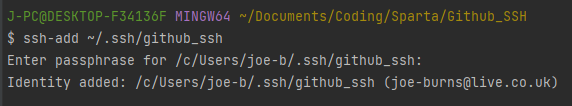

## Guide to setting up SSH keys!

1. Open Git bash and use `cd` to take you to the root directory

2. then `mkdir .ssh` to make new ssh hidden directory (you can see it with `ls -a`), then change to that directory with `cd .ssh`

3. Key pairs are created through the `ssh-keygen` command! We will use `ssh-keygen -t rsa -b 4096 -C "<email>"`, and will need to name the file, as well as give a password.

4. Return back to the local directory for your repo, and use `eval ssh-agent` with ssh-agent surrounded by backticks (cant show this in .md file)... Repeat whenever Pycharm is opened.

5. `ssh-add ~/.ssh/<ssh_folder_filename>` to add the private key identities you have saved in your .ssh folder to the Git authentication agent so I dont need to type in my key each time I access my repo.

6. The public key needs to be then provided to Github, so we can connect. This is available in the .pub file in your .ssh folder. We then need to navigate to `https://github.com/settings/ssh/new` and input the public key, along with a name.

7. Then type `ssh -T git@github.com` to connect to your Github using SSH!

8. Finally, initialise the repo with `git init`, create new repo on Github and use `git remote add origin git@github.com:<text>` then `git remote set-url origin git@github.com:<sshkey>` to set as origin, where the SSH key is the key in the picture below.

9. Then stage, commit and push as usual!
